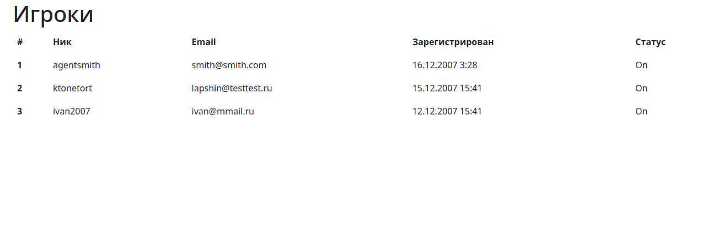

# Тестовое задание на Web-программиста - Targem Games (PHP)

**Выполнил Дронов Дмитрий**

Запуск:

> Не забудьте настроить подключение к БД в файле `export.php`! Некоторые переменные можно задать с помошью файла `.env` (скрыт в гите), либо как переменные среды.

> Заметьте, что скрипту нужна уже созданная БД (DATABASE), однако таблицы внутри неё создаются автоматически. 

1. Скрипт `export.php` - для экспорта данных из csv
2. Скрипт `index.php` - для отображения таблицы пользователей

После экспорта должна появиться таблица, как на скриншоте:

*Сортировку сделал по времени регистрации в порядке убывания, т.е. первым отображается пользователь, который зарегистрировался позже всех.*

Для того, чтобы очистить данные в БД (чтобы потом повторно проверить экспорт), можно прописать `npm run clean`